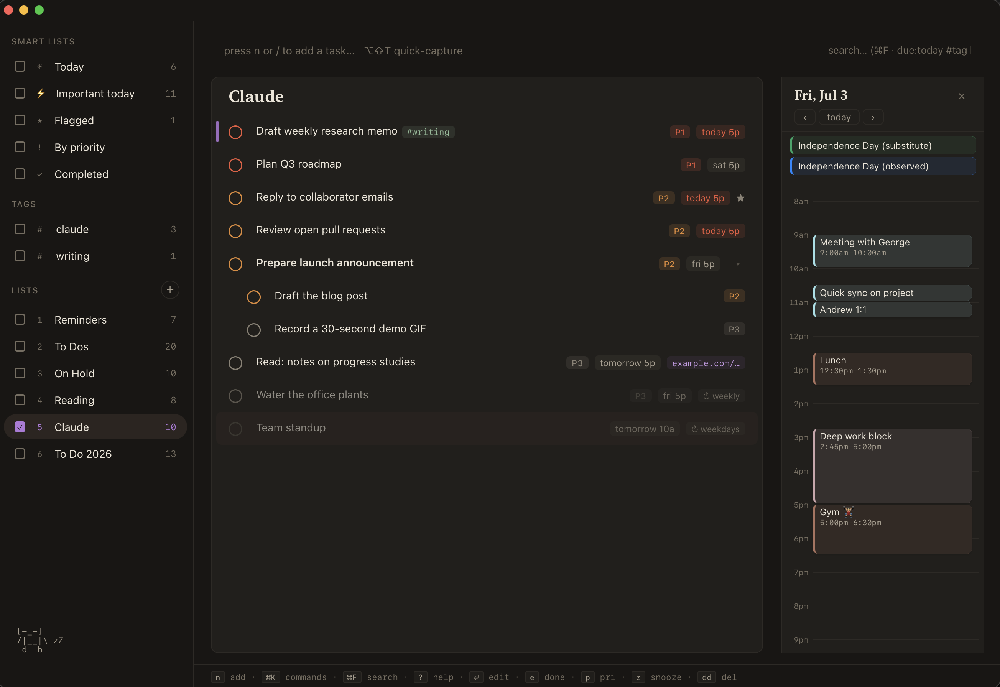

# keydo-app

A fast, keyboard-first Mac app for **Apple Reminders**.



Your tasks live in Reminders (synced via iCloud across Mac, iPhone, iPad, Watch). Habits and the app's organization settings are stored locally on your Mac.

## Why this design

- **Apple Reminders is the source of truth.** Tasks you create here show up on your iPhone's Reminders app, and vice versa — changes from other devices appear live. You can stop running this app any time; your data stays in Reminders.
- **No accounts, no cloud servers, no sync code.** Apple handles all of that.
- **Native app, web UI.** A small Swift shell (WKWebView) hosts the web frontend and manages the local server — one Dock icon, no Terminal, no browser tab.

## "So why not just use Apple Reminders?"

Fair question. **Apple Reminders is the task backend.** Every task you see here is a real reminder in Apple's database, synced through your own iCloud. Notifications, Siri, and shared lists keep working through Apple's apps. Changes and deletions made here also propagate through iCloud, so sync is not an independent backup against accidental changes.

Habit history and the recovery bin live in `~/Library/Application Support/todo-app/`. Sections, parent links, manual order and snoozes live in the web view's local storage and do not sync through Reminders. Keep a Mac backup to protect local data. The recovery bin retains task snapshots for up to seven days. Deletions that would exceed its 2,000-entry capacity are blocked before tasks are removed. New snapshots preserve full repeat rules and completion dates; older snapshots cannot recover fields they never recorded.

What Apple Reminders doesn't have is the layer on top:

| Added here | What it does |
|---|---|
| Full keyboard control | `j`/`k` to move, `e` to complete, `p` for priority, `b` to bump a due date, `dd` to delete, Tab to nest. Hands never leave the keyboard |
| Quick-add syntax | `Buy milk !high ?friday 3pm #grocery ls:todos` sets priority, date, recurrence, tags, and list in one line |
| System-wide capture (⌥⇧T) | Pop a capture panel from *any* Mac app, same syntax |
| Command palette (⌘K) | Every action, list, and tag reachable by typing |
| Multi-pane views | Pin several lists side by side, drag panes to reorder |
| Calendar pane | Your day's calendar events next to your tasks |
| Snooze | "Not today": the task dims and sinks until its day comes |
| Undo / redo | ⌘Z takes back completes, edits, deletes, and drags |
| Recoverable trash | Local recovery bin for task and list deletions, subject to the capacity and restore limitations above |
| Smart-list drops | Drag a task onto Today / Important / Flagged to reschedule, prioritize, or flag it |
| Overdue rescue | One command reschedules every overdue task to today |
| Plan your day | ⌘K "Plan your day": triage overdue + today one task at a time, single-key verbs, ends with a summary |
| Habit dots | Weekly-target habits in the sidebar (4×/week beats fragile streaks); gym habits can rotate kinds (push → pull → legs → cardio) and show what's next |
| AI integration (MCP) | A local AI assistant can read, search, add, and organize your tasks; configure write approvals in your MCP client |
| Reading list | Pasted URLs become clean links, collected in a read-later view |
| Tester feedback | File bugs and feature ideas locally, then copy all open reports as one structured email/Claude packet |
| The small stuff | A dark/light theme that was fussed over, a completion tick sound, an optional ASCII desk buddy |

And one more thing: **you have the full source code**, and it's deliberately simple (vanilla JS, no framework, no build step). If you want the app to behave differently, you're one prompt away: point Claude Code or Codex at the repo and describe the change. If you want Apple Reminders to behave differently, good luck.

## Requirements

- macOS 12 (Monterey) or later, Intel or Apple Silicon
- Talks to Apple Reminders through EventKit — macOS only (no Windows/Linux/web-hosted version)
- Node.js 20+ — `brew install node`
- Xcode Command Line Tools for the Swift shell + daemon — `xcode-select --install`

## Building from source

```bash
git clone https://github.com/taoburga/keydo-app.git
cd keydo-app
npm install              # Node deps: @modelcontextprotocol/sdk, chrono-node
bash daemon/build.sh     # compiles bin/reminders-daemon (the server also rebuilds it when stale)
bash shell/build.sh      # builds shell/build/Todo.app — the Mac app bundle
```

Then launch `shell/build/Todo.app` (double-click it, or **symlink** it into `/Applications` / `~/Applications` so Spotlight and Launchpad find it). A symlink is the smoothest route: the app finds its server by walking up from its real location inside this repo, so it just works. If you do copy the bundle somewhere else, it will ask you once to point it at this folder (the one containing `server.js`) and remember your answer. Either way the checkout has to stay on disk — the bundle is not self-contained. To run just the web UI without the native shell, use `./start.sh` (see below).

## Launching

**Spotlight → "Todo"** (or Launchpad / Dock), once you've symlinked the built bundle somewhere Spotlight indexes:

```bash
ln -s "$PWD/shell/build/Todo.app" ~/Applications/Todo.app
```

First launch: macOS asks for Reminders access → System Settings → **Privacy & Security → Reminders** → enable **Todo App**. One-time. The app also registers itself as a **login item** (once — remove it in System Settings → General → Login Items if unwanted) so ⌥⇧T capture works right after a reboot.

**Closing the window does not quit.** The app keeps running in the background (Dock icon stays) so the system-wide ⌥⇧T capture and live sync stay available; click the Dock icon to bring the window back. **⌘Q quits fully.**

### Alternative: from a terminal

```bash
./start.sh                      # from the repo root: runs the server in the foreground at http://127.0.0.1:4321
PORT=5000 ./start.sh            # if 4321 is taken
```

## Keyboard map

Press `?` (or double-click the bottom hint bar) for the always-current overlay. Highlights:

| key | action |
|---|---|
| `n` or `/` | focus quick-add |
| `⌥⇧T` | quick capture — **works system-wide**: inside the app it opens the capture overlay; from any other Mac app it pops a floating capture panel (same syntax) |
| `⌘K` | command palette |
| `⌘F` | search |
| `j`/`k` or arrows | move selection |
| `e` | toggle complete |
| `Enter` | full editor · single-click = quick-action strip |
| `p` | cycle priority · `b`/`⇧B` due +1/−1 day · `w` due → weekend · `f` flag |
| `dd` | delete (double-tap) · `⌘Z`/`⌘⇧Z` undo/redo |
| `Tab`/`⇧Tab` | indent/outdent (subtasks) · `⇧S` assign section |
| `⌘⏎` / `⌘⌥⏎` | add task below / add sub-task |
| `1`–`9` | switch list · `s` cycle sort · `c` show completed · `r` refresh |

## Quick-add syntax

```
Buy milk !high ?friday 3pm #grocery ls:todos
Pay rent ?every month
```

- **Priority:** `!high` `!med` `!low` (and `!1` `!!!` `!!`) — `!!!`=high, `!!`=med, a spaced-out `!`=low; glued punctuation like `done!` stays text
- **Due (bare, no marker needed):** `tomorrow` `friday` `this weekend` `next week` `may 3` `end of month` `2026-05-15`, with times/periods (`friday 1pm`, `tomorrow morning`, `tonight`)
- **Due (`?` forces a date the bare words skip):** `?sat` `?27th` `?3 may` `?mid may` `?5/15` `?eod` `?eow`
- **Recurrence:** `?every day/weekday/week/month/year/monday`
- **List:** `ls:<name>` (fuzzy) · **Tags:** `#tag` — typing `#` or `ls:` pops an autocomplete of your existing tags/lists (↑/↓ to pick, Enter/Tab to accept, Esc to dismiss)
- **Links:** paste a URL anywhere in the text → it's pulled out into the task's link field instead of the title
- **Changed your mind about a date?** Click the date chip in the preview to keep those words in the title instead (click "date off" to parse it again)

## Architecture

```
shell/              Swift WKWebView shell → builds shell/build/Todo.app
public/             vanilla HTML + JS + CSS (no framework, no build step)
server.js           Node HTTP server (loopback; 4321 by default), /api/* + static
lib/reminders.js    stdio client to the Swift daemon
daemon/             Swift EventKit daemon source (bash daemon/build.sh)
bin/reminders-daemon  compiled daemon (auto-rebuilt at server startup if stale)
mcp-server.js       MCP server (15 tools) for Claude Code sessions
test/               npm test (node --test)
```

**How it works:** the shell spawns `node server.js`, which spawns one long-lived `reminders-daemon` Swift process. The daemon holds an `EKEventStore` and answers JSON over stdin/stdout (~1–5 ms per op, vs 150–500 ms for osascript). The daemon also pushes a `changed` event on every EventKit store change (including iCloud pushes from your iPhone); the server forwards it over Server-Sent Events (`GET /api/events`) and the UI refreshes itself.

Logs: `~/Library/Logs/todo-app/server.log` (previous launch kept as `server.prev.log`).

### API endpoints

```
GET    /api/ping
GET    /api/events                 Server-Sent Events: `changed` on store changes
GET    /api/lists                  → [{id, name}]
POST   /api/lists                  body: {name}
PATCH  /api/lists/:id              body: {name}
GET    /api/lists/counts           → {listId: openCount}
GET    /api/reminders?list=ID[&completed=1]
GET    /api/reminders[?completed=1]   all lists
POST   /api/quickadd               body: {text, listId?} — parses full quick-add syntax, creates the task, echoes what it understood (used by the ⌥⇧T panel; handy for Shortcuts)
POST   /api/reminders              body: {listId, name, body?, dueDate?, priority?, url?, recurrence?, alarms?}
PATCH  /api/reminders/:id          body: any subset of the above (+ completed)
DELETE /api/reminders/:id          recoverable — moved to a 7-day trash bin, not erased
GET    /api/page-title?url=URL     fetches a saved link's <title>; the app's ONLY outbound request, blocked from private/loopback hosts
GET    /api/trash                  recently deleted tasks (7-day recoverable bin)
POST   /api/trash/:id/restore
DELETE /api/trash/:id
POST   /api/report                 body: {type, text, diagnostics} — local-only bug/feature report sink
GET    /api/reports/export         → structured Markdown packet containing open local reports
```

`priority`: `none|high|medium|low`. `dueDate`: ISO date-time for timed tasks, bare `YYYY-MM-DD` for all-day; reads include an `allDay` boolean. Validation errors return 400 with `{error, code:"bad_request"}`; daemon-unavailable returns 500 with `code:"unavailable"`.

## Using it with an AI assistant (optional MCP server)

The repo ships an optional [Model Context Protocol](https://modelcontextprotocol.io) server (`mcp-server.js`) that lets a local AI assistant — e.g. [Claude Code](https://claude.com/claude-code) — read and write your Reminders. It exposes 15 tools: **8 read** (list lists, get, search, tags, summary, history, plus the published briefing and meeting preps) and **7 write** — 5 that touch tasks (add, add-bulk, update, complete, delete) and 2 display-only publishers for the briefing pop-up and meeting-prep cards, which never touch a task.

Two app surfaces exist just for the assistant:

- **Morning briefing.** The assistant publishes a day plan (`briefing_set`), and the app pops it up once, the first time you open it that day. Done-marks and comments you leave in the pop-up flow back to the assistant's next run.
- **Meeting prep.** The assistant publishes a prep brief for a calendar event (`meeting_prep_set`), and the event gets a click-open prep card in the calendar pane.

Starter skills for both (a daily check-in and a meeting-prep flow, including how to schedule the briefing to run automatically each morning) live in [examples/skills/](examples/skills/README.md).

**This is off by default.** Nothing connects to an assistant unless you register the server yourself — see [docs/mcp-install.md](docs/mcp-install.md). Before you do, here's how it stays safe:

- **You approve every write.** The write tools are meant to run in "ask" mode, so your assistant must get your confirmation before each add / update / complete / delete. Every write tool also takes `dry_run: true` to preview a change without making it.
- **It's local.** The tools drive the same on-device daemon the app uses; this MCP sends nothing about your tasks to a remote server.
- **The "Claude" list convention.** The tools are told to treat a Reminders list named literally **`Claude`** as the assistant's own scratch space (free to organize there), and to mostly leave your *other* lists alone — at most adding a due date to a task that has none, or tagging a task `#claude` to mark that it surfaced it for today. This is a convention in the tool instructions, **not** a hard lock — your approval prompts are the real gate, so review writes to lists you care about (and if you'd rather an assistant never have a free-write space, just don't create a list named `Claude`). The list name is a convention in the tool instructions; set `TODO_APP_ASSISTANT_LIST` in the MCP server's environment to use a different name.

## Retry safety

Creates and restores save local operation receipts. Repeating the same operation ID returns its recorded result. If a connection fails before the outcome can be confirmed, the app blocks that operation from creating a duplicate. Check Apple Reminders and keep the local `operations.json` file for diagnosis; do not delete it or repeatedly submit altered copies to bypass the block. MCP callers can supply `operation_id` to `tasks_add` and reuse it on retries.

## Troubleshooting

- **macOS won't open the app ("unidentified developer" or "damaged")** → it's an unsigned local build; the first time, right-click the app → **Open** (or run `xattr -dr com.apple.quarantine shell/build/Todo.app`). `shell/build.sh` already ad-hoc-signs it, but Gatekeeper can still prompt once.
- **"Reminders access denied"** → System Settings → Privacy & Security → Reminders → enable Todo App (or Terminal if running `start.sh`), then press `r`.
- **Blank/unresponsive window** → the app now detects server death and offers Restart; if all else fails check `~/Library/Logs/todo-app/server.log`.
- **Port 4321 already in use** → Todo.app stops and asks you to free port 4321, preserving the origin used for your local organization settings. Terminal runs can use `PORT=5000 ./start.sh`, but each port has separate local storage.

## License

Released under the [MIT License](LICENSE) — use, modify, and share it freely; no warranty.

**Your data stays yours.** Tasks live in Apple's Reminders database, synced via your own iCloud. If you ever stop using this app, every task is still in your iPhone's Reminders app. No accounts, no lock-in.
